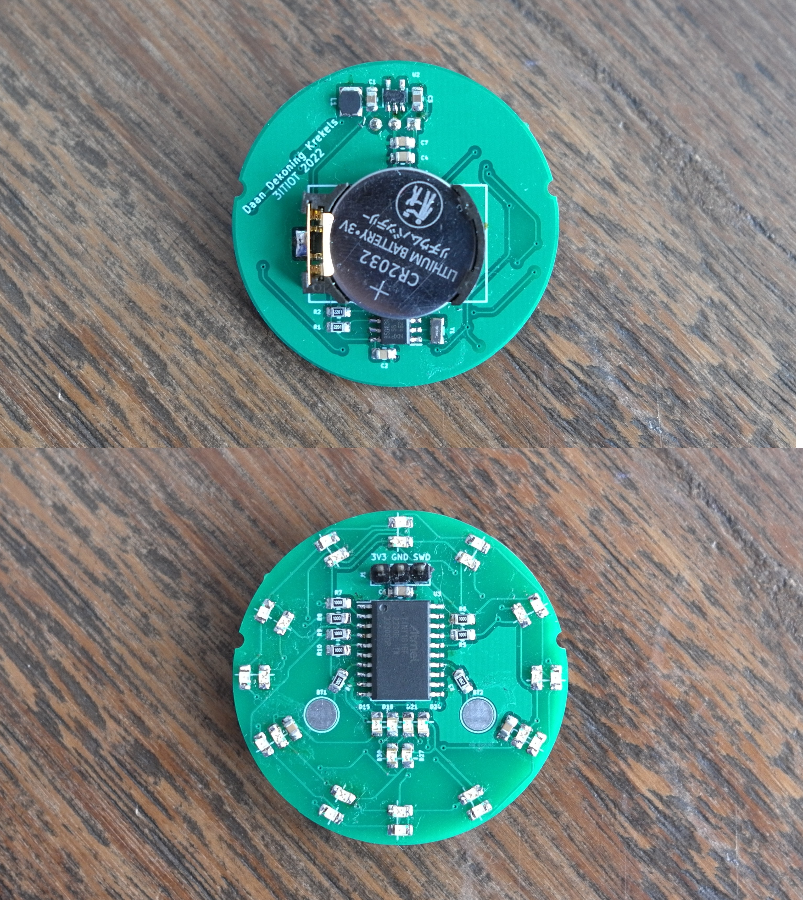

# PCB Horloge

## Snelle links

- [Opdrachtomschrijving](./oo1-opdrachtbeschrijving.pdf)
- [Onderzoeksdocument](./onderzoeksdocument.md)
- [PCB-ontwerp](./src/kicad-project/)
- [Testplan bestukken printplaat](testplan.md)
- [Proces softwareontwikkeling](proces-softwareontwikkeling.md)
  - [Horloge code](./src/TinyHorloge/TinyHorloge.ino)
  - [Finale code met pomodoro](src/pomodoro-test/pomodoro-test.ino)


## Project structuur

```
.
├── assets                  (figuren)
├── datasheets              (datasheets gebruikte componenten)
└── src                     (alle bronbestanden)
    ├── HI-loop             (onderzoek efficiënte code)
    ├── HI-register         (onderzoek efficiënte code)
    ├── kicad-project       (PCB-ontwerp)
    ├── LED-test            (alle leds laten branden)
    ├── LED-volgorde-test   (leds op volgorde laten branden)
    ├── pomodoro-test       (definitieve code met pomodero timer)
    ├── PTC-interrupt-test  (mislukte tests met slaapmodus)
    ├── PTC-test            (capacitieve sensoren implementeren)
    ├── RTC-test            (RTC proberen aanspreken)
    └── TinyHorloge         (alles gecombineerd, zonder pomodero)
```


## Verslag PCB-Horloge

In deze repository kan alle informatie teruggevonden worden rond dit project. Onderstaande video biedt een demonstratie van de werking.

Het effect dat zichtbaar is wanneer de timer afgaat komt niet tot zijn recht dankzij het aliasing effect. In het echt lijkt de buitenste ring echter constant ingeschakeld.

<figure>
<iframe src="https://ap.cloud.panopto.eu/Panopto/Pages/Embed.aspx?id=9face490-216e-4a69-b10b-af8400b9f26b&autoplay=false&offerviewer=true&showtitle=true&showbrand=false&captions=false&interactivity=all" height="405" width="720" style="border: 1px solid #464646;" allowfullscreen allow="autoplay"></iframe>
<figcaption><a href="https://ap.cloud.panopto.eu/Panopto/Pages/Embed.aspx?id=9face490-216e-4a69-b10b-af8400b9f26b&autoplay=false&offerviewer=true&showtitle=true&showbrand=false&captions=false&interactivity=all">Video met demonstratie PCB-Horloge</a></figcaption>
</figure>

Het onderzoeksdocument beschrijft de algemene verwachtingen voor dit project en hoe ik van plan was het aan te pakken. Ik denk dat het onderzoek vrij goed aansluit met hoe het project uiteindelijk is verlopen.

Dit is het elektrisch schema van het horloge:


Zo zou het horloge eruit zien:


Dit is hoe de definitieve printplaat eruit ziet:



Er zijn uiteraard wel een aantal dingen die ik, wanneer ik een tweede iteratie zou maken van dit project, ander zou doen. 

Zo heb ik jammer genoeg geen behuizing kunnen maken voor mijn horloge. Ik heb met de lokale juwelier gesproken om te bekijken of zij eventueel een horloge behuizing had waar mijn printplaat in kon passen. Daarvoor heb ik het 3D-model van de printplaat met componenten geprint. Op deze manier kon ik, voordat de printplaten waren aangekomen, al op zoek naar een geschikte behuizing. De juwelier wou graag helpen, jammer genoeg had zij geen horloges die groot genoeg waren voor mijn printplaat. Een volgende versie zou dus zeker een aantal millimeter kleiner moeten.

De code die ik geschreven heb, waarvan je de definitieve versie [hier](src/pomodoro-test/pomodoro-test.ino) kan terugvinden, is eigenlijk een state-machine geworden. Het probleem met mijn aanpak is dat de uitdrukkelijke stadia niet duidelijk zijn vormgegeven in de code. Met wat extra tijd zou ik de software herschrijven naar een nette state-machine.

Als extraatje zou het mooi zijn om de interrupt voor de PTC knoppen goed werkende te krijgen. Zo kan er veel energie bespaard worden door slaapmodi.