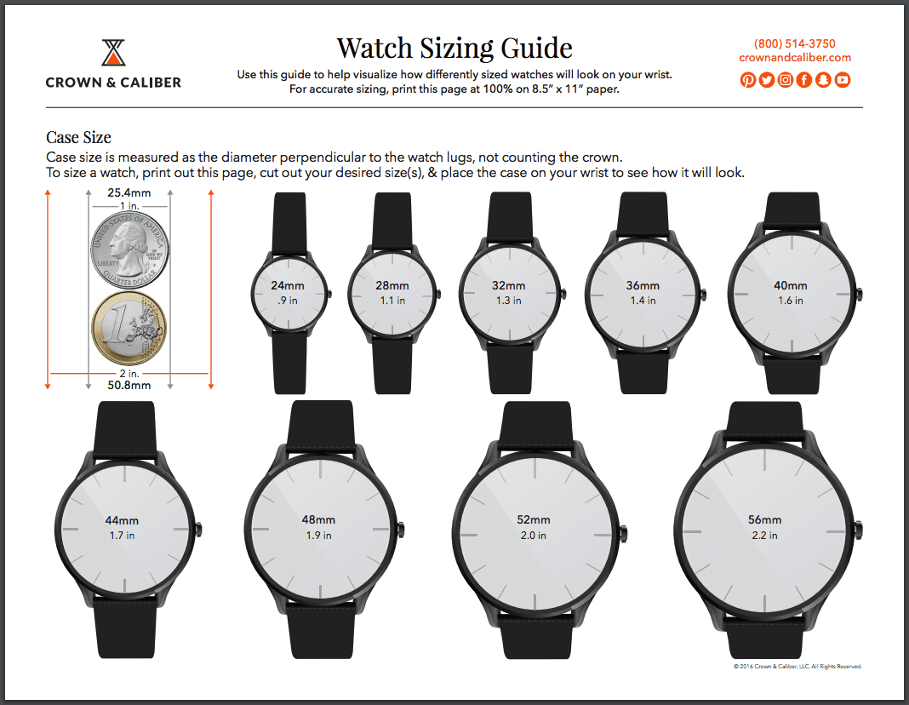
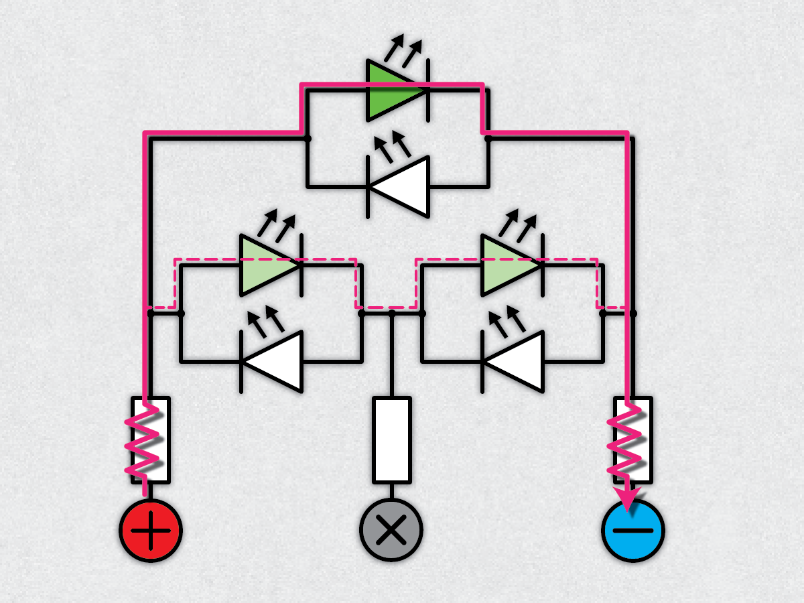
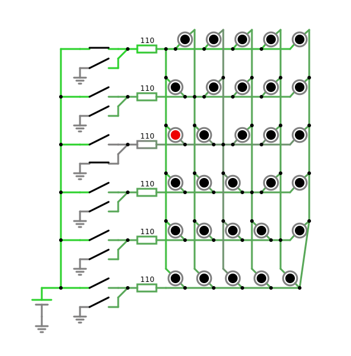
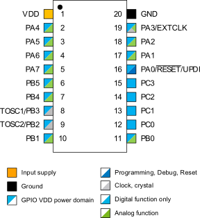
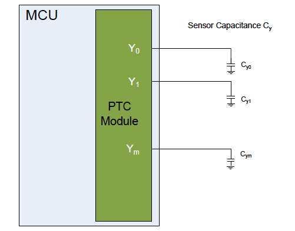
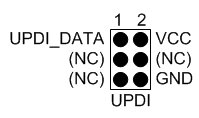
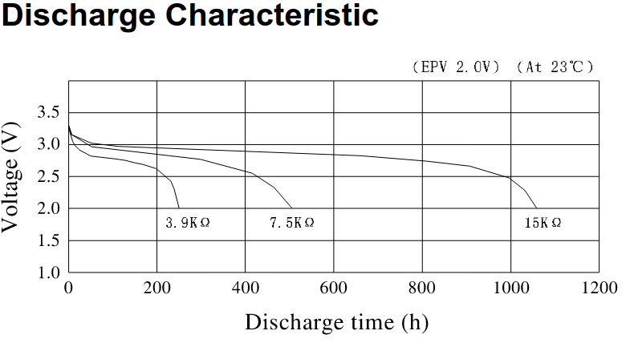

# Onderzoeksdocument – PCB Horloge

*Daan Dekoning Krekels*

## Welke restricties zijn er voor het formaat van de PCB

*Ga op zoek naar courante formate voor horloges. Lijst deze op en bepaal welke jezelf gaat gebruiken* 

Op [Crown & Caliber](https://blog.crownandcaliber.com/watch-sizing-chart/) staat een duidelijke prent met informatie over de verschillende diameters van horloges. Zelf vind ik de groottes rond 40mm het meest aangenaam.

  

Ook de dikte ven de behuizing is belangrijk. Ik vind het zelf storend als een horloge aan de dikkere kant is. [Watchcomfort](https://watchcomfort.com/watch-size-chart/) heeft een duidelijke figuur gemaakt die de verschillende veelvoorkomende diktes weergeeft. Liefst blijf ik tussen 6 mm en 8 mm. Omdat de batterijhouder al 5,3 mm dik is zal een dikte rond de 8mm het meer realistisch zijn.

  

## Wat is charlieplexing

*De LEDs worden op de PCB aangestuurd d.m.v. een charlieplex configuratie. Leg kort uit wat dit is en hoe jij dit gaat toepassen in je ontwerpen.* 

Bij charlieplexing kunnen we met een minimaal aantal GPIO pinnen toch relatief veel LED’s aansturen. Dit omdat we gebruik maken van het feit dat een LED enkel bij de juiste polariteit licht geeft.

De formule om te weten hoeveel LED’s we kunnen aansturen met het beschikbare aantal pinnen is. Bij 2 pinnen kunnen we 2 LED’s aansturen, bij 6 pinnen zijn dat al 30 LED’s.  

Er zal telkens één GPIO pin laag worden gezet en één GPIO pin hoog worden gezet, alle andere pinnen worden hoog impedant gehouden om ervoor te zorgen dat er zo min mogelijk stroom door passeert. In de illustratie (1) is te zien dat er maar een zeer kleine stroom kan vloeien door de twee leds die toevallig ook juist gepolariseerd staan. Een GPIO pin hoog impedant zetten kan gedaan worden door deze als een INPUT in te stellen.

Voor het horloge kunnen we opteren voor 6 pinnen om zo de 24 LED’s aan te sturen. Het is ook mogelijk om 2x 4 pinnen te gebruiken en zo op 24 LED’s uit te komen.
Verder onderzoek moet duidelijk maken welke keuze het beste is. 2x 4 pinnen is misschien softwarematig gemakkelijker om aan te sturen maar gebruikt meer GPIO pinnen van onze MCU. Met 6 pinnen hebben we er ook genoeg om voor de individuele minuten een indicator te maken.

  

Onderstaan een simulatie van de geïmplementeerde charlieplex schakeling. Er brandt maar één LED want dat is de enige die rechtstreeks verbonden is tussen de VCC en GND. Er zijn ook leds die in eigenlijk wel doorverbonden zijn van VCC naar GND, maar bij deze loopt de stroom door 2 LED’s waardoor ze niet oplichten. De weerstanden voor iedere GPIO lijn is de helft van de berekende weerstandwaarde omdat de stroom door 2 weerstanden gaat vloeien want $R_{T}=R_1+R_2$.

Waarheidstabel van de LED’s aanwezig op het elektrisch schema. 0 Is massa, 1 is VCC en Z is hoog-impedant. Programmatisch gezien zal 0 I/O pin op LOW zijn, 1 een I/O pin op HIGH en Z een I/O pin als INPUT. 

1. https://www.instructables.com/Charlieplexing-Made-Easy-and-What-It-Even-Means/
2. https://en.wikipedia.org/wiki/Charlieplexing
3. https://www.instructables.com/Charlieplexing-LEDs--The-theory/

## Welke pinnen worden er gebruikt in mijn design en waarom

*Vele pinnen van een microcontroller hebben meestal een dubbele functionaliteit. In dit vooronderzoek ga je kijken welke pinnen het veiligste zijn om te gebruiken.*

We gebruiken de SOIC pinout van de ATtiny   
 microcontroller. Bepaalde pinnen zijn maar bruikbaar voor één doel, zo hebben we **VDD** en **GND** die uiteraard niet aan te passen zijn. 

**TOSC1** kan (moest dat nodig zijn) gebruikt worden voor het 32 kHz klok signaal, afkomstig van de RTC.

Om energie te besparen zal de MCU voor het meeste van de tijd in een slaapmodus verkeren en laten we het bijhouden van de tijd over aan de RTC IC. Deze IC is zuiniger. Wanneer we de tijd willen weergeven zal de MCU uit slaapmodus gaan. De RTC wordt aangesloten via een I²C bus, dat zijn **PA1** (SDA) en **PA2** (SCL) of **PB1** (SDA) en **PB0** (SCL).

Om de wijzer LED’s op de horloge te activeren en om de pomodoro in te stellen wordt er gebruik gemaakt van de Peripheral Touch Controller (PTC) in Self-Capacitance Mode. In deze modus moet een Y-pin gebruikt worden om de aanraking te detecteren. PTC heeft de mogleijkheid om de MCU te wekken uit power-save Sleep mode. **PA4** tot **PA7**, **PB0**, **PB1**, **PB4**  **PB5** en **PC0** tot **PC****3** kunnen gebruikt worden voor de peripheral touch sensor.

De LED’s zullen aangesloten worden via charlieplexing. Op deze manier kunnen we 2x 12 LED’s aansturen en eventueel nog 4 extra LED’s om de individuele minuten aan te geven. Dit kunnen we doen met slechts 6 GPIO pinnen.

Voor de LED’s kunnen we gebruik maken van alle pinnen die een digitale en analoge funcitie bieden. Dit omdat we de pin op ,  en  moeten kunnen instellen. Een mogelijke selectie is **PA1**, **PA2**, **PA4**, **PA5**, **PA6** en **PA7**. Het feit dat al deze pinnen op hetzelfde reigster zitten kan het eventueel achteraf ook gemakkelijker maken om duidelijke code te schrijven.

Om de MCU te kunnen programmeren moeten we maar 3 pinnen naar buiten brengen: **RESET**, GND en VDD. We kunnen deze pinnen beschikbaar maken door een aantal lege kopervlakken te laten. Het is niet nodig om een externe RESET knop aan te sluiten. Moest de MCU gereset worden tijdens het testen, dan kan de RESET aansluiting tijdelijk recht naar de massa gekoppeld worden.

PTC design guidelines: https://www.microchip.com/en-us/application-notes/an42360

## Hoe programmeer ik de microcontroller

*Onderzoek hoe je de microcontroller kan programmeren en werk dit praktisch uit*

De ATtiny beschikt over een UPDI of Unified Program and Debug Interface. Deze biedt de mogelijkheid om via één enkele aansluiting de MCU te programmeren. Omdat deze aansluiting via de RESET pin gebeurt, geven we hier ook geen enkele GPIO pin voor op.

Deze interface biedt ook de mogelijkheid tot een   
 half-duplex UART-verbinding op te zetten om bijvoorbeeld debug informatie te kunnen tonen.

Voor het programmeren via deze interface hebben we minstens toegang nodig tot de RESET pin, VDD en GND. De Atmel-ICE kan gebruikt worden om het programma naar de MCU te schrijven.

## Welke clockconfiguratie gebruikt mijn design en waarom

*Een microcontroller heeft meestal verschillende opties voor het aansturen van interne clockmodel. Licht toe welke optie je gaat gebruiken en waarom.* ***Let op:*** *Hoe nauwkeuriger hoe meer punten*

Zoals in op de volgende vraag geantwoord wordt werkt de klok van de ATtiny bij 1,8 V op maximaal 5 MHz. Dit is dus ook de kloksnelheid waarop de MCU zal draaien. Op deze snelheid zullen nog alle gebruikte functies werken (I²C, sleep modes, ...). 

De PCF85063A RTC heeft geen nood aan een externe 32 kHz oscillator dus deze kan eventueel weggelaten worden. Echter, kan deze oscillator aan de OSCO en OSCI pinnen worden aangesloten. Moest de ATtiny achteraf ook een 32 kHz klok nodig hebben, dan kan de CLKOUT pin van de RTC aangesloten worden aan de TOSC1 van de MCU. TOSC1 is hier boven EXTCLK gekozen omdat TOSC1 kan ingesteld worden om een extern 32 kHz kloksignaal te ontvangen.

Omdat beide IC’s de kristal zouden willen aansturen en omdat de langere banen ongewilde capaciteiten kunnen leven is het best om het kristal maar op één van de IC’s aan te sluiten.

## Hoe wordt de PCB van stroom voorzien?

*Op welk spanningsniveau zal je PCB werken, Hoe ga je het correcte voltage voorzien aan de horloge.*   

De knoopcel die in de batterijhouder past is een 3 V lithium batterij. 

De spanning van deze batterijen zal over tijd dalen van 3 V naar 2 V. De spanningsregelaar zal dus met dit spanningsbereik moeten werken. 

Zie rechts de ontladingskarakteristiek van een [Multicomp](https://www.farnell.com/datasheets/1671733.pdf) knoopcel.

De dropout voltage van de MCP1824 is typisch 300mV. Dit wil zeggen dat de ingangsspanning hoger moet zijn dan de . De minimale uitgangsspanning is dus 1,8 V. Dit komt goed uit want de minimale werkingsspanning van de ATtiny is ook 1,8 V. Ook de PCF85063A RTC kan werken op deze spanning, zijn werkingsspanning is 0,9V tot 5,5V. 1,8V is de minimale spanning waarop de I²C bus van de RTC module kan werken, dit komt dus perfect uit met de rest van de schakeling.

Wanneer de ATtiny werkt op 1,8 V is zijn maximale kloksnelheid 5MHz. Dit is echter geen probleem. 

Om energie te besparen zal de MCU voor het merendeel van de tijd in slaapstand verkeren. Enkel wanneer een van de capacitieve sensoren geactiveerd wordt zal de MCU ontwaken en de tijd van de RTC uitlezen en weergeven. Hopelijk kan op deze manier een spaarzame werking gegarandeerd worden.

Bovenstaand onderzoek kan nog steeds werken, echter is het lastig om LED’s te vinden die werken bij 1,8V. Om deze reden heb ik gekozen om de spanningsregelaar volledig weg te laten. Iedere component kan werken op een spanning van 3V tot 2V dus dit zou in principe geen probleem mogen zijn. Het enige probleem dat zich eventueel kan voordoen is dat de chips niet voorzien zijn in een spanningsdaling waardoor bijvoorbeeld de klok niet stabiel zal draaien. In een horloge is dit uiteraard best belangrijk maat ik wil de gok wagen. 

Volgend de datasheet van de RTC kan deze, bij een platte batterij, kan terugvallen op een supercondensator van 1F. Mijn redenering is dat de spanning van deze condensator ook zal dalen. Als deze spanningsdaling geen probleem is zal de knoopcel ook geen probleem zijn.

Online heb ik verschillende projecten gevonden die ook gebruik maken van een RC2032 knoopcel. Veel projecten sluiten hun MCU rechtstreeks aan op de knoopcel.

https://mathscitech.org/articles/tinyphoto

https://mathscitech.org/articles/tinyphoto

https://github.com/PaulKlinger/mrna_vaccine_badge

https://mitxela.com/projects/amulet

https://github.com/NPoole/BeanCounter/blob/main/docs/BC_BuildSheet.pdf

https://raw.githubusercontent.com/pypewpew/pewpew-lcd/master/pewpew-lcd-v2-schematic.pdf

Na verder onderzoek kwamen we uit op een switching boost regulator die bruikbaar kan zijn voor het type knoopcellen dat we willen gebruiken. https://www.instructables.com/Power-Management-for-CR2032/

Een schakelende spanningsregelaar is ook vele malen efficiënter dan de lineaire regelaar die we eerst gingen gebruiken. Ook de stabiliteit van de spanning en het feit dat we dan ieder component op 3,3V kunnen laten werken is een enorm voordeel. Zo zal de spanning van de batterij er niet meer voor zorgen dat de leds op een andere intensiteit zullen branden.

De TPS61221 die in bocenstaande wron gebruikt wordt is spijtig genoeg nergens beschikbaar, maar dankij mr. Luyts hebben we twee vervangende componenten gevonden. 

https://www.digikey.be/en/products/detail/texas-instruments/TPS61097-33DBVR/2092365

[https://eu.mouser.com/ProductDetail/Texas-Instruments/TPS61291DRVT?qs=6E8igxPflKclok%252BjdNvlFw%3D%3D](https://eu.mouser.com/ProductDetail/Texas-Instruments/TPS61291DRVT?qs=6E8igxPflKclok%2BjdNvlFw%3D%3D)

Ik zal gebruik maken van de TPS61097-33DBVR. Dit omat zijn footprint er iets realistischer uitziet en omdat deze voor onze batterij ideaal lijkt. Dezelfde regelaar kan ook in een ander projectvak nog goed van pas komen omdat deze regelaar overweg kan met zonnecellen.

Een potentieel probleem bij het gebruik van een lineaire regelaar is de ruis die er gegenereert wordt door het schakelen van de interne mosfets. De capacitieve PTC snesoren die ik wil toepassen kunnne daar eventueel problemen bij ondervinden. Hier zal ik dan ook rekening mee houden bij het ontwerpen van de prinplaat.