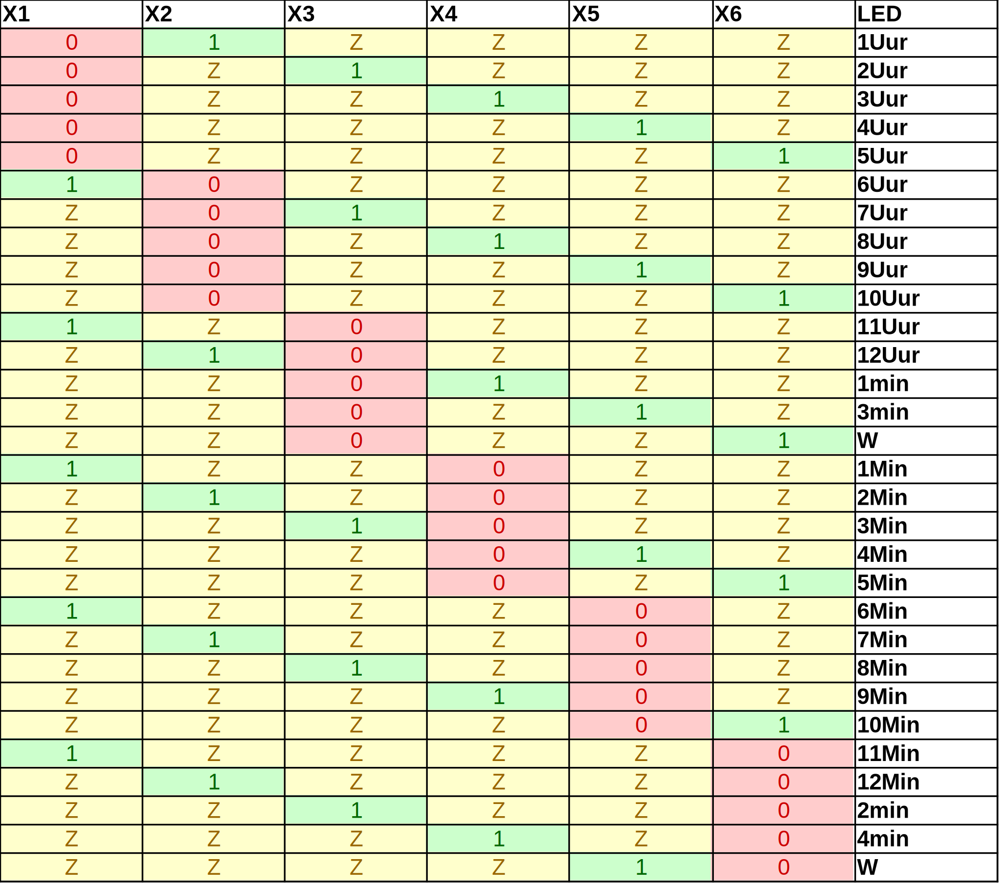

# Proces softwareontwikkeling

Zoals in het testplan te lezen is werd niet alle software in 1x geschreven. Er moesten incrementeel delen (individueel) getest worden om te weten of alles naar behoren werkt.


## Enkel MCU

Voor het programmeren van de MCU via de Arduino IDE is gekozen voor de [megaTinyCore](https://github.com/SpenceKonde/megaTinyCore) boardfiles. Dit porject is immens goed gedocumenteerd en alles is terug te vinden op de eerder gelinkte GitHub pagina.

Het programmeren zelf verloopt via [jtag2updi](https://github.com/ElTangas/jtag2updi), een tool die het mogleijk maake om met een Arduino NANO een UPDI microcontroller te programmmeren. magaTinyCore heeft ondersteuning op jtag2updi als programmer te gebruiken. 

De code die hier gebruikt is is een simpele blinky op PA2.


## Alle LED's aansturen

Om de LED's aan te sturen heb ik meerdere sketches gemaakt. De simpelste sketch loopt gewoon door alle pinnen heen en zet alle combinaties van de poorten aan, zonder rekening te houden met de specifieke volgorde van de oplichtende LED's.

[LED Test Code](src/LED-test/LED-test.ino)

Nadat dit is gelukt ben ik beginnen te denken over de beste manier om de LED's aan te sturen. Hoe kan ik de juiste LED laten branden om een bepaald uur weer te geven?

De pinnen heb ik doorheen de sketches als volgt gedefinieerd:
```c++
#define X1 PIN_PA1
#define X2 PIN_PA2
#define X3 PIN_PA4
#define X4 PIN_PA5
#define X5 PIN_PA6
#define X6 PIN_PA7

const byte AANTAL_LED_PINS = 6;
const byte LED_PINS[] = { X1, X2, X3, X4, X5, X6 };
```
De benamingen X1 - X6 heb ik ook gebruikt in mijn schema en onderzoek dus dat leek me een duidelijke alias voor de pinnen. Gemakkelijk ter referentie met de waarheidstabel.  

In principe zijn alle pinnen altijd hoog impedant (`INPUT`), maar twee van de 6 pinnen moeten als `OUTPUT` ingesteld zijn en daar hoef ter maar één van op `HIGH` te staan. Ik heb lookuptables opgesteld, gebaseerd op de waarheidstabel in mijn onderzoeksdocument. De lookuptable heeft de vorm van een 2D attay en bevat hevenveel items als er uren of minuten zijn. Per uur of minuut is er een array voorzien met 2 items, de pin die `LOW` moet zijn en de pin die `HIGH` moet zijn. Alle andere pinnen zijn echter sowieso `INPUT`. De index van deze array is gelijk aan het uur dat moet weergegeven worden.



Als eerste heb ik een waarheidstabel opgesteld voor alle LED's, zodat ik ze een voor een op volgorde kon laten oplichten.

Later heb ik LUT's gemaakt voor alle uren en minuten apart.

```c++
const byte UREN[12][2]{
  // 0    1
  { X3, X2 },  // 12 Uur
  { X1, X2 },  // 1  Uur
  { X1, X3 },  // 2  Uur
  { X1, X4 },  // 3  Uur
  { X1, X5 },  // 4  Uur
  { X1, X6 },  // 5  Uur
  { X2, X1 },  // 6  Uur
  { X2, X3 },  // 7  Uur
  { X2, X4 },  // 8  Uur
  { X2, X5 },  // 9  Uur
  { X2, X6 },  // 10 Uur
  { X3, X1 }   // 11 Uur
};
```
In bovenstaande code wordt er verwezen naar de eerder gedefinieerde pin aliassen die ook terug te vinden zijn in de waarheidstabel en het elektrisch schema. 

[LED's op Volgorde Code](src/LED-volgorde-test/LED-volgorde-test.ino)

Bovenstaande gelinkte code loopt doorheen alle uren en alle minuten. Telkens worden de LED's uitgeschakeld met de `reset_LED_pins()` functie.

```c++
void reset_LED_pins() {
  for (byte i = 0; i < AANTAL_LED_PINS; i++) {
    pinMode(LED_PINS[i], INPUT);  // Alle pinnen hoog impedant zetten
  }
}
```
De for-loop maakt bovenstaande code verre van performant. 


## RTC testen

De code van de werkende LED's kan verder gebruikt worden om ander onderdelen te testen. Voor de RTC heb ik [online een Arduino bibliotheek](https://github.com/SolderedElectronics/PCF85063A-Arduino-Library) gevonden die het werken met de PCF85063A vergemakkelijkt.

Het instellen en uitlezen van de tijd zijn nu maar [een paar lijnen code](https://github.com/SolderedElectronics/PCF85063A-Arduino-Library/blob/master/examples/basic/basic.ino).


[RTC Test Code](src/RTC-test/RTC-test.ino)

In bovenstaande code zijn de arrays voor uren en minuten uitgebreid. De uren array telt nu 24 items omdat de RTC niet in 12h modus te zetten is. De array voor de minuten is nu 60 items lang.

Voor de minuten zijn, in mijn ontwerp, maar 12 LED's voorzien. Dat is één LED per 5 minuten. Ik zou softwarematig kunnen afronden om zo te berekenen welke minuten LED het dichtste bij zit, maar daarvoor heb je een deling nodig en dat vraagt rekentijd. Om deze berekening te vereiden heb ik bij iedere individule minuut een LED aangesteld. Zo hebben xx:03, xx:04, xx:05, xx:06 en xx:07 allen de combinatie voor de LED van 5 minuten gekregen.

De functie `set_hour()` en `set_minute()` maken het gemakkelijk om het juiste uur weer te geven.

```c++
void set_hour(int hour) {
  pinMode(UREN[hour][0], OUTPUT);
  pinMode(UREN[hour][1], OUTPUT);
  digitalWrite(UREN[hour][0], LOW);
  digitalWrite(UREN[hour][1], HIGH);
}

void set_minute(int minute) {
  pinMode(MINUTEN[minute][0], OUTPUT);
  pinMode(MINUTEN[minute][1], OUTPUT);
  digitalWrite(MINUTEN[minute][0], LOW);
  digitalWrite(MINUTEN[minute][1], HIGH);
}
```

De `reset_LED_pins()` functie is ook geoptimaliseerd met één enkele registermanipulatie.

```c++
void reset_LED_pins() {
  PORTA.DIR = 0b00000000;         // set all pins as an output
}
```

### Optimalisatie `reset_LED_pins()`

Ik analyseer even de optimalisatie die mogelijk is door het aanpassen van de code naar een registermanipulatie.

- [Alle pinnen als input via register code](src/HI-register/)
- [Alle pinnen als input via loop code](src/HI-loop/)

De originele code gebuikt 512 bytes aan program space.

>Sketch uses 520 bytes (1%) of program storage space.

De geoptimaliseerde code gebruikt 349 bytes.

>Sketch uses 394 bytes (1%) of program storage space.

Het merendeel van de extra bytes zijn de functies die de Arduino compiler moet toevoegen om onder de bitpositie van de Arduino pin te achterhalen. 

De binaire bestanden zitten mee in deze repository. MEt het volgende commando kunnen de gebruikte instructies achterhaald worden.


`avr-objdump -Sz HI-register.ino.elf`

```Cpp-ObjDump
void reset_LED_pins() {
  PORTA.DIR = 0b00000000;  // set all pins as an output
 180:	10 92 00 04 	sts	0x0400, r1	; 0x800400 <__RODATA_PM_OFFSET__+0x7f8400>
 184:	ff cf       	rjmp	.-2      	; 0x184 <main+0x5a>
```
`avr-objdump -d HI-register.ino.elf`

```Cpp-ObjDump
 17a:	80 93 80 0a 	sts	0x0A80, r24	; 0x800a80 <__RODATA_PM_OFFSET__+0x7f8a80>
 17e:	78 94       	sei
 180:	10 92 00 04 	sts	0x0400, r1	; 0x800400 <__RODATA_PM_OFFSET__+0x7f8400>
 184:	ff cf       	rjmp	.-2      	; 0x184 <main+0x5a>
```

`avr-objdump -Sz HI-loop.ino.elf`

```Cpp-ObjDump
void reset_LED_pins() {
  for (byte i = 0; i < AANTAL_LED_PINS; i++) {
 1be:	d2 e8       	ldi	r29, 0x82	; 130
 1c0:	a8 30       	cpi	r26, 0x08	; 8
 1c2:	bd 07       	cpc	r27, r29
 1c4:	f9 f6       	brne	.-66     	; 0x184 <main+0x5a>
 1c6:	ff cf       	rjmp	.-2      	; 0x1c6 <main+0x9c>
```
`avr-objdump -Sz HI-loop.ino.elf`

```Cpp-ObjDump
 17a:	80 93 80 0a 	sts	0x0A80, r24	; 0x800a80 <_ZL8LED_PINS+0x7f887e>
 17e:	78 94       	sei
 180:	a2 e0       	ldi	r26, 0x02	; 2
 182:	b2 e8       	ldi	r27, 0x82	; 130
 184:	8d 91       	ld	r24, X+
 186:	82 31       	cpi	r24, 0x12	; 18
 188:	d0 f4       	brcc	.+52     	; 0x1be <main+0x94>
 18a:	90 e0       	ldi	r25, 0x00	; 0
 18c:	fc 01       	movw	r30, r24
 18e:	e0 51       	subi	r30, 0x10	; 16
 190:	fe 47       	sbci	r31, 0x7E	; 126
 192:	20 81       	ld	r18, Z
 194:	2f 3f       	cpi	r18, 0xFF	; 255
 196:	99 f0       	breq	.+38     	; 0x1be <main+0x94>
 198:	fc 01       	movw	r30, r24
 19a:	e2 52       	subi	r30, 0x22	; 34
 19c:	fe 47       	sbci	r31, 0x7E	; 126
 19e:	e0 81       	ld	r30, Z
 1a0:	e2 95       	swap	r30
 1a2:	ee 0f       	add	r30, r30
 1a4:	f0 e0       	ldi	r31, 0x00	; 0
 1a6:	f4 60       	ori	r31, 0x04	; 4
 1a8:	22 83       	std	Z+2, r18	; 0x02
 1aa:	84 53       	subi	r24, 0x34	; 52
 1ac:	9e 47       	sbci	r25, 0x7E	; 126
 1ae:	ec 01       	movw	r28, r24
 1b0:	88 81       	ld	r24, Y
 1b2:	80 61       	ori	r24, 0x10	; 16
 1b4:	e8 0f       	add	r30, r24
 1b6:	f1 1d       	adc	r31, r1
 1b8:	80 81       	ld	r24, Z
 1ba:	87 7f       	andi	r24, 0xF7	; 247
 1bc:	80 83       	st	Z, r24
 1be:	d2 e8       	ldi	r29, 0x82	; 130
 1c0:	a8 30       	cpi	r26, 0x08	; 8
 1c2:	bd 07       	cpc	r27, r29
 1c4:	f9 f6       	brne	.-66     	; 0x184 <main+0x5a>
 1c6:	ff cf       	rjmp	.-2      	; 0x1c6 <main+0x9c>
```

Zoals te zien in het tweede voorbeeld zien we dat lijn `17a` - `sei` (enable interrupts) telkens de laatste gemeenschappelijke code is. Alles wat daarachter komt, is puur om alle pinnen als input te schakelen. Dit maakt het duidelijke dat de twee instructies van de registermanipulatie vele malen efficiënter zijn!

## Capacitieve sensoren testen


## Alles samen brengen


